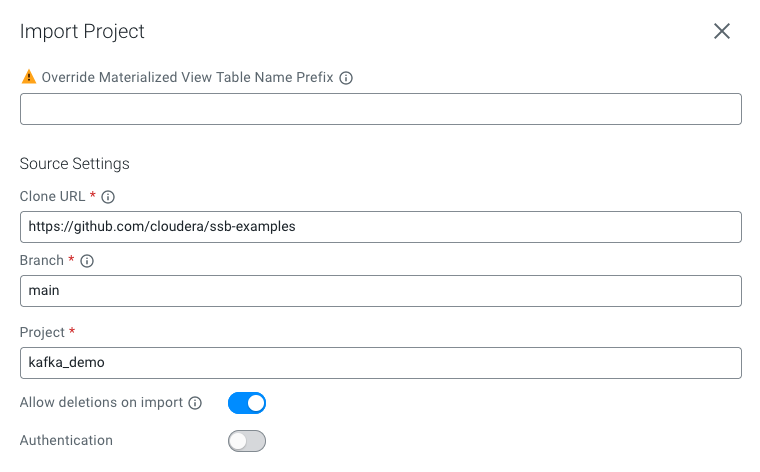

# Kafka pipeline Demo
In this exercise, you can learn how to connect to Kafka, read and write topics. 

You will also learn about a few of SQL Stream Builder's features:
- Add a Materialized View
- How to create an input transformation
- Use timestamp data provided by Kafka

You can follow along a step-by-step guide, or import the project into SSB to experiment with it.

These jobs use a Data Generator for fake data.

## Trying this example
Open SSB on http://localhost:18121, log in with the `admin`/`admin` credentials.
You have 2 options at this point.

### Option A: Do the exercises manually
To practice using SSB, follow the [step-by-step guide](docs/kafka_exercise.md).

**OR**

### Option B: Import the project containing the solutions
Click on Import Project and use the following settings to clone the solutions:

The imported project contains a Data Source (`kafka`), 5 virtual tables, and 5 jobs.

You can execute the jobs and inspect the results.

**Make sure to start the `data_generator` job first, and keep it running in the background while trying other jobs.**

## Cleanup

After you are done with this demo, stop the running `data_generator` job. 

You can also delete the topics that were created throughout this demo in [SMM](http://localhost:9991), as well as 
the schemas in [Schema Registry](http://localhost:7788).

