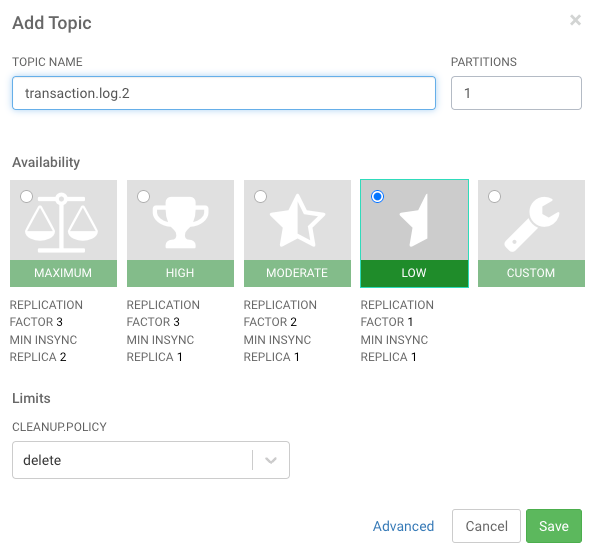
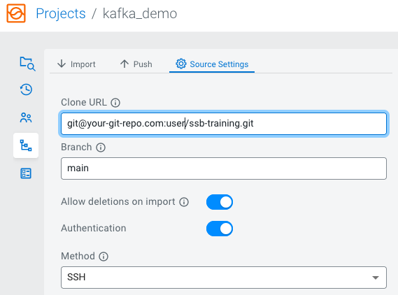

# Kafka pipeline Demo

Open SSB on [localhost:18121](http://localhost:18121) and create a new project (`kafka_demo`).

## Setup the Data Generator
1. Open SSB on [localhost:18121](http://localhost:18121)
2. Create a new Job named `data_generator` by right-clicking **Jobs** in the Explorer on the left.
3. Paste the following into the SQL editor and click Execute:
   ```sql
    DROP TABLE IF EXISTS datagen;
    DROP TABLE IF EXISTS kafka_transaction_sink;
    CREATE TABLE `ssb`.`kafka_demo`.`datagen` (
      `transactionId` INT,
      `itemId` STRING,
      `quantity` INT
    ) WITH (
      'fields.transactionId.expression' = '#{number.numberBetween ''100000000'',''999999999''}',
      'fields.itemId.expression' = '#{numerify ''item_####''}',
      'connector' = 'faker',
      'fields.quantity.expression' = '#{number.numberBetween ''-500'',''500''}'
    );
    CREATE TABLE `ssb`.`kafka_demo`.`kafka_transaction_sink` (
      `transactionId` INT,
      `ts` BIGINT,
      `itemId` STRING,
      `quantity` INT
    ) WITH (
      'properties.auto.offset.reset' = 'earliest',
      'format' = 'json',
      'scan.startup.mode' = 'earliest-offset',
      'properties.bootstrap.servers' = 'kafka:9092',
      'connector' = 'kafka',
      'topic' = 'transaction.log.1'
    );
    INSERT INTO kafka_transaction_sink SELECT transactionId, UNIX_TIMESTAMP(), itemId, quantity FROM datagen;
   ```
4. The job should start running (you can check on the [Flink Dashboard](http://localhost:8081)), and a Kafka topic is created
and populated with fake transaction data. You can check its contents in [Streams Messaging Manager](http://localhost:9991).
5. Keep the `data_generator` job running in the background while you do the exercises.

## Exercise 1 - Read from a Kafka table + show data on MV
1. Open SSB on [localhost:18121](http://localhost:18121)
3. Create a new Kafka Table by right-clicking  **Virtual Tables** and click on **New Kafka Table**
4. Set the parameters to the following:
   Table Name: `transaction_log_1`
   Kafka Cluster: `Local Kafka`
   Data Format: `JSON`
   Topic Name: `transaction.log.1`
5. Click on **Detect Schema** to detect the Schema of the messages in the topic
6. Click **Create and Review** and then **Close**
7. Create a new job by right-clicking **Jobs** an then **New Job**, name the job `kafka_demo_1`
8. Write the following query in the editor:
```sql
SELECT * FROM transaction_log_1
```
9. Click on **Materialized View** in the top right corner
10. Select *transactionId* as Primary Key, Create a new **API Key** with the plus button  name it *kafka_demo_key* and after saving it select it.
11. Click **Add New Query**, set *kafka_demo* as **URL Pattern**, click **Select All**, go to **Filters** click on **+Rule** and set the following:
    Field: quantity
    Operator: greater
    Value: 0
    Click **Create** and after that switch the **Enable MV** parameter to true
12. Close the tab and click **Execute**
    Now you should see the messages in the topic. If you click on **Materialized View** there you should find the link to your materialized view, click on it to see the results.
13. Stop the job

## Exercise 2 - Read and Write a Kafka table + Data Transformation
1. Create a new job named `kafka_demo_2`
2. Create a new Kafka Table named `transaction_log_1_transformed`, and set the properties as before, but **don't click on Detect Schema**. The schema should look like this:
```json
{
	"type":  "record",
	"name":  "exampleSchema",
	"fields":  [
		{
			"name":  "itemId",
			"type":  "string"
		},
		{
			"name":  "transactionType",
			"type":  "string"
		}
	]
}
```
3. Go to the **Data Transformation** tab, and insert this code there:
```javascript
var topic = record.topic;
// Kafka record key, if any
var key = record.key;
// Kafka partition
var partition = record.partition;
// Kafka record offset
var offset = record.offset;
// Kafka record headers (if any)
var headers =  JSON.parse(record.headers);
var headers_map = headers ? headers.reduce(function(acc, cur)  {
acc[cur[0]]  = cur[1];
return acc;
},  {})  :  {};
// Kafka payload (record value JSON deserialized to JavaScript object)
var payload =  JSON.parse(record.value);
var output =  {};
output['topic']  = topic;
output['itemId']  = payload.itemId;
output['transactionType']  = payload.quantity >  0  ?
'inputTransaction'  :  'outputTransaction';
JSON.stringify(output);
```

4. Save the table
5. Run:
```sql
select * from transaction_log_1_transformed
```

> Now you have added a transformation to the data. The next step is to write the results to another topic. Open Streams Messaging Manager at [localhost:9991](http://localhost:9991) and create a topic called `transaction.log.2`  where the transformed data will be written.


6. In SSB, create a new Kafka table with the created topic. Kafka Provider, Data Format and
   Schema Definition should be the same as *transaction_log_transformed*.
```json
{
	"type":  "record",
	"name":  "exampleSchema",
	"fields":  [
		{
			"name":  "itemId",
			"type":  "string"
		},
		{
			"name":  "transactionType",
			"type":  "string"
		}
	]
}
```

**Important: Do not set anything in the Data Transformation tab**. The Table Name should be `transaction_log_2` and the Topic Name should be `transaction.log.2`. Save the table.
7. Run the following (in the `kafka_demo_2` job) to write to the topic:
```sql
insert into transaction_log_2 select * from transaction_log_1_transformed
```
8. Create a new job named `kafka_demo_3`, to check if there is anything in the `transaction.log.2` topic. (Keep `kafka_demo_2` running)
9. Run the following SQL to check what is inside the topic:
```sql
select * from transaction_log_2
``` 
10. Now you can stop the `kafka_demo_3` job, but keep `kafka_demo_2` running, you will need that in the next exercise.

## Exercise 3 - Read from a Kafka table + Kafka Timestamps
1. Create a new job named `kafka_demo_4`
2. Run the following time based query:
```sql
SELECT
	`transactionType`,
	TUMBLE_START(eventTimestamp, INTERVAL '10'  SECOND)  AS wStart,
	COUNT(*)  as numberOfTransactions
FROM transaction_log_2
WHERE transactionType =  'inputTransaction'
GROUP  BY
	TUMBLE(eventTimestamp, INTERVAL '10'  SECOND), `transactionType`
```
> Here the data is grouped into 10 second windows, and the job performs aggregation within these. The query returns the type of the transaction and the start time of the 10 sec window, and the number of the input transactions that happened in the given time window.
3. You can stop every running SSB job (but don't stop the DataGenerator yet).

## Training exercise
Use a data transformation to query the small (50>quantity>-50) and the large (50<quantity OR quantity<-50) transactions and write them into a new kafka topic.
To solve this exercise you will need these steps:

1. Create a new topic, where you will write the results
2. Create a new Kafka Table with Data Transformation (over topic *transaction.log.1*)
3. Create a Kafka Table with the new topic
4. Create a Job where you write from the Kafka Table with Data Transformation to the Kafka Table with the new topic.
5. (Check the results) Create a new job where you read the Kafka Table with the new topic.


HINTS:
<details> <summary>Schema Definition of both topics</summary>

    {
        "type": "record",
         "name": "exampleSchema",
         "fields": [
           {
             "name": "itemId",
             "type": "string"
           },
           {
             "name": "transactionSize",
             "type": "string"
           }
         ]
    }
</details>

<details> <summary>Data Transformation JS</summary>

    var topic = record.topic;
    // Kafka record key, if any
    var key = record.key;
    // Kafka partition
    var partition = record.partition;
    // Kafka record offset
    var offset = record.offset;
    // Kafka record headers (if any)
    var headers = JSON.parse(record.headers);
    var headers_map = headers ? headers.reduce(function(acc, cur) {
    acc[cur[0]] = cur[1];
    return acc;
    }, {}) : {};
    // Kafka payload (record value JSON deserialized to JavaScript object)
    var payload = JSON.parse(record.value);
    
    var output = {};
    output['topic'] = topic;
    output['key'] = key;
    output['itemId'] = payload.itemId;
    output['transactionSize'] = payload.quantity > 50 || payload.quantity < -50 ?
    'largeTransaction' : 'smallTransaction';
    JSON.stringify(output);
</details>

## Done
Congratulations, you have now finished these exercises. You can now stop the `data_generator` job (by right-clicking its name, or opening it in SSB, and clicking on Stop)

To persist your solution, you can configure a Git repository to upload it to in the Source Control menu.


Then navigate to the Push tab, provide a commit message, and push your work.

