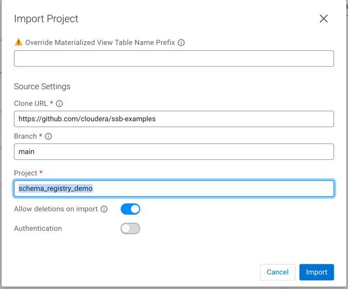

# Schema Registry and UDF Demo
In this exercise, you can learn how to use Schema Registry, temporal joins and UDFs in your SSB projects.

You will learn about a few of SQL Stream Builder's features:
- Use schemas from Schema Registry
- Temporal joins
- User Defined Functions

You can follow along a step-by-step guide, or import the project into SSB to experiment with it.

These jobs use a Data Generator for fake data.

## Trying this example
Open SSB on http://localhost:18121, log in with the `admin`/`admin` credentials.
You have 2 options at this point.

### Option A: Do the exercises manually
To practice using SSB, follow the [step-by-step guide](docs/schema_registry_exercise.md).

**OR**

### Option B: Import the project containing the solutions
Click on Import Project and use the following settings to clone the solutions:

The imported project contains 2 Data Sources, 2 functions, 5 virtual tables, and 6 jobs. **Java UDFs are not included in the import.**

You can execute the jobs and inspect the results. 

Note:
- You must manually register the schemas in Schema Registry, as described in the [step-by-step guide](docs/schema_registry_exercise.md).
- Some jobs may require for the data generator jobs to be running in the background for data to be available.
- You must manually upload the [get-pilot](resources/get-pilot/target) and [lookup-address](resources/lookup-address/target) Java UDFs.
## Cleanup

After you are done with this demo, stop all your running jobs.

You can also delete the topics that were created throughout this demo in [SMM](http://localhost:9991), as well as
the schemas in [Schema Registry](http://localhost:7788).

